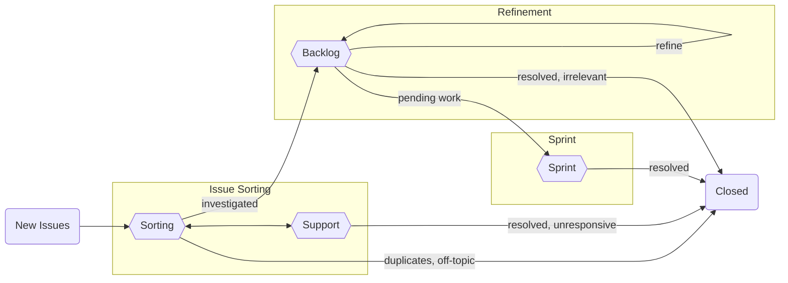
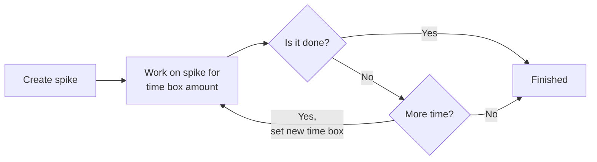

<!-- absolute URLs -->
[conda-org]: https://github.com/conda
[sub-team]: https://github.com/conda-incubator/governance#sub-teams

[project-planning]: https://github.com/orgs/conda/projects/2/views/11
[project-sorting]: https://github.com/orgs/conda/projects/2/views/11
[project-support]: https://github.com/orgs/conda/projects/2/views/12
[project-backlog]: https://github.com/orgs/conda/projects/2/views/13
[project-sprint]: https://github.com/orgs/conda/projects/2/views/14

[docs-toc]: https://github.blog/changelog/2021-04-13-table-of-contents-support-in-markdown-files/
[docs-actions]: https://docs.github.com/en/actions
[docs-saved-reply]: https://docs.github.com/en/get-started/writing-on-github/working-with-saved-replies/creating-a-saved-reply

[workflow-sync]: https://github.com/conda/infra/blob/main/.github/workflows/sync.yml
[labels-global]: https://github.com/conda/infra/blob/main/.github/global.yml

<!-- relative URLs -->
[workflow-issues]: /.github/workflows/issues.yml
[workflow-project]: /.github/workflows/project.yml
[labels-local]: /.github/labels.yml

# How We Use GitHub

> **Note**
> For easy navigation use [GitHub's table of contents feature][docs-toc].

This document seeks to outline how we as a community use GitHub Issues to track bugs and feature requests while still catering to development practices & project management (*e.g.*, release cycles, feature planning, priority sorting, etc.).

<!-- only include high-level topics or particularly noteworthy sections here -->
Topics:
  - [What is Issue Sorting?](#what-is-issue-sorting)
  - [Types of tickets](#types-of-tickets)
    - [Normal Ticket/Issue](#normal-ticketissue)
    - [Epics](#epics)
    - [Spikes](#spikes)

## What is "Issue Sorting"?

> **Note**
> "Issue sorting" is similar to that of "triaging", but we've chosen to use different terminology because "triaging" is a word related to very weighty topics (*e.g.*, injuries and war) and we would like to be sensitive to those connotations. Additionally, we are taking a more "fuzzy" approach to sorting (*e.g.*, severities may not be assigned, etc.).

"Issue Sorting" refers to the process of assessing the priority of incoming issues. Below is a high-level diagram of the flow of tickets:

In order to explain how various `conda` issues are evaluated, the following document will provide information about our sorting process in the form of an FAQ.

### Why sort issues?

At the most basic "bird's eye view" level, sorted issues will fall into the category of four main priority levels:

- Do now
- Do sometime
- Provide user support
- Never do (_i.e._, close)

At its core, sorting enables new issues to be placed into these four categories, which helps to ensure that they will be processed at a velocity similar to or exceeding the rate at which new issues are coming in. One of the benefits of actively sorting issues is to avoid engineer burnout and to make necessary work sustainable; this is done by eliminating a never-ending backlog that has not been reviewed by any maintainers.

There will always be broad-scope design and architecture implementations that the `conda` maintainers will be interested in pursuing; by actively organizing issues, the sorting engineers will be able to more easily track and tackle both specific and big-picture goals.

### Who does the sorting?

Sorting engineers are a `conda` governance [sub-team][sub-team]; they are a group of Anaconda and community members who are responsible for making decisions regarding closing issues and setting feature work priorities, amongst other sorting-related tasks.

### How do items show up for sorting?

New issues that are opened in any of the repositories in the [`conda` GitHub project][conda-org] will show up in the `Sorting` view of the [Planning project][project-planning]. This process is executed via [GitHub Actions][docs-actions]. The two main GitHub Actions workflows utilized for this purpose are [Issues][workflow-issues] and [Project][workflow-project].

The GitHub Actions in the `conda/infra` repository are viewed as canonical; the [Sync workflow][workflow-sync] sends out any modifications to other `conda` repositories from there.

### What is done about the issues in "sorting" mode?

Issues in the ["Sorting" tab of the project board][project-sorting] have been reviewed by a sorting engineer and are considered ready for the following procedures:

- Mitigation via short-term workarounds and fixes
- Redirection to the correct project
- Determining if support can be provided for errors and questions
- Closing out of any duplicate/off-topic issues

The sorting engineers on rotation are not seeking to _resolve_ issues that arise. Instead, the goal is to understand the ticket and to determine whether it is an issue in the first place, and then to collect as much relevant information as possible so that the maintainers of `conda` can make an informed decision about the appropriate resolution schedule.

Issues will remain in the "Sorting" tab as long as the issue is in an investigatory phase (_e.g._, querying the user for more details, asking the user to attempt other workarounds, other debugging efforts, etc.) and are likely to remain in this state the longest, but should still be progressing over the course of 1-2 weeks.

### When do items move out of the "Sorting" tab?

The additional tabs in the project board that the issues can be moved to include the following:

- **"Support"** - Any issue in the ["Support" tab of the Planning board][project-support] is a request for support and is not a feature request or a bug report. All issues considered "support" should include the https://github.com/conda/infra/labels/type%3A%3Asupport label.
- **"Backlog"** - The issue has revealed a bug or feature request. We have collected enough details to understand the problem/request and to reproduce it on our own. These issues have been moved into the [Backlog tab of the Planning board][project-backlog] at the end of the sorting rotation during Refinement.
- **"Closed"** - The issue was closed due to being a duplicate, being redirected to a different project, was a user error, a question that has been resolved, etc.

### Where do items go after being sorted?

All sorted issues will be reviewed by sorting engineers during a weekly Refinement meeting in order to understand how those particular issues fit into the short- and long-term roadmap of `conda`. These meetings enable the sorting engineers to get together to collectively prioritize issues, earmark feature requests for specific future releases (versus a more open-ended backlog), tag issues as ideal for first-time contributors, as well as whether or not to close/reject specific feature requests.

Once issues are deemed ready to be worked on, they will be moved to the [`conda` Backlog tab of the Planning board][project-backlog] on GitHub. Once actively in progress, the issues will be moved to the [Sprint tab of the Planning board][project-sprint] and then closed out once the work is complete.

### What is the purpose of having a "Backlog"?

Issues are "backlogged" when they have been sorted but not yet earmarked for an upcoming release. Weekly Refinement meetings are a time when the `conda` engineers will transition issues from "[Sorting][project-sorting]" to "[Backlog][project-backlog]". Additionally, this time of handoff will include discussions around the kind of issues that were raised, which provides an opportunity to identify any patterns that may point to a larger problem.

### What is the purpose of a "development sprint"?

After issues have been sorted and backlogged, they will eventually be moved into the "Sprint Candidate", "Short-Term", "Medium-Term", "Long-Term", or "No Time Frame" sections of the [Backlog tab of the Planning board][project-backlog] and get one or more sprint cycles dedicated to them.

The purpose of a development sprint is to enable a steady delivery of enhancements, features, and bug fixes by setting aside pre-determined portions of time that are meant for focusing on specifically-assigned items.

Sprints also serve to focus the engineering team's attention on more accurate planning for what is to come during the entire release cycle, as well as keep the scope of development work concise. They enable the setting aside of dedicated time for the engineers to resolve any problems with the work involved, instead of pushing these problems to the end of the release cycle when there may not be any time remaining to fix issues.

### How does labeling work?

Labeling is a very important means for sorting engineers to keep track of the current state of an issue with regards to the asynchronous nature of communicating with users. Utilizing the proper labels helps to identify the severity of the issue as well as to quickly understand the current state of a discussion.

Generally speaking, labels with the same category are considered mutually exclusive but in some cases labels sharing the same category can occur concurrently as they indicate qualifiers as opposed to types. For example, we may have the following types, https://github.com/conda/infra/labels/type%3A%3Abug, https://github.com/conda/infra/labels/type%3A%3Afeature, and https://github.com/conda/infra/labels/type%3A%3Adocumentation, where for any one issue there would be _at most_ **one** of these to be defined (_i.e._ an issue shouldn’t be a bug _and_ a feature request at the same time). Alternatively, with issues involving specific operating systems (_i.e._, https://github.com/conda/infra/labels/os%3A%3Alinux, https://github.com/conda/infra/labels/os%3A%3Amacos, and https://github.com/conda/infra/labels/os%3A%3Awindows), an issue could be labeled with one or more depending on the system(s) the issue is occurring on.

Please note that there are also automation policies in place. For example, if an issue is labeled as https://github.com/conda/infra/labels/pending%3A%3Afeedback and https://github.com/conda/infra/labels/unreproducible, that issue will be auto-closed after a month of inactivity.

### How are new labels defined?

Labels are defined using a scoped syntax with an optional high-level category (_e.g._, source, tag, type, etc.) and a specific topic, much like the following:

- `[topic]`
- `[category::topic]`
- `[category::topic-phrase]`

This syntax helps with issue sorting enforcement; at minimum, both `type` and `source` labels should be specified on each issue before moving it from "`Sorting`" to "`Backlog`".

There are a number of labels that have been defined for the different `conda` projects. In order to create a streamlined sorting process, label terminologies are standardized using similar (if not the same) labels.

### How are new labels added?

New **global** labels (_i.e._, generic labels that apply equally to all `conda` repos) can be added to the `conda/infra`'s [`.github/global.yml` file][labels-global]; new **local** labels (_i.e._, labels specific to particular `conda` repos) can be added to each repository's [`.github/labels.yml`][labels-local] file. All new labels should follow the labeling syntax described in the "How are new labels defined?" section of this document.

### Are there any templates to use as responses for commonly-seen issues?

Some of the same types of issues appear regularly (_e.g._, issues that are duplicates of others, tickets that should be filed in the Anaconda issue tracker, errors that are due to a user's specific setup/environment, etc.).

Below are some boilerplate responses for the most commonly-seen issues to be sorted:

<b>Duplicate Issue</b>

<pre>

This is a duplicate of <b>[link to primary issue]</b>; please feel free to continue the discussion there.
</pre>

> **Warning**
> Apply the https://github.com/conda/infra/labels/duplicate label to the issue being closed and https://github.com/conda/infra/labels/duplicate%3A%3Aprimary to the original issue.

<b>Requesting an Uninstall/Reinstall of <code>conda</code></b>

<pre>

Please uninstall your current version of `conda` and reinstall the latest version.
Feel free to use either the [miniconda](https://docs.conda.io/en/latest/miniconda.html)
or [anaconda](https://www.anaconda.com/products/individual) installer,
whichever is more appropriate for your needs.
</pre>

<b>Redirect to Anaconda Issue Tracker</b>

<pre>

Thank you for filing this issue! Unfortunately, this is off-topic for this repo.
If you are still encountering this issue please reopen in the
[Anaconda issue tracker](https://github.com/ContinuumIO/anaconda-issues/issues)
where `conda` installer/package issues are addressed.
</pre>

> **Warning**
> Apply the https://github.com/conda/infra/labels/off-topic label to these tickets before closing them out.

<b>Redirecting to Nucleus Forums</b>

<pre>

Unfortunately, this issue is outside the scope of support we offer via GitHub;
if you continue to experience the problems described here,
please post details to the [Nucleus forums](https://community.anaconda.cloud/).
</pre>

> **Warning**
> Apply the https://github.com/conda/infra/labels/off-topic label to these tickets before closing them out.

In order to not have to manually type or copy/paste the above repeatedly, please note that it's possible to add text for the most commonly-used responses via [GitHub's "Add Saved Reply" option][docs-saved-reply].

---

## Types of issues

The following section describes the different types of issues that we create in our GitHub
projects and how/why they are used.

## Standard Ticket/Issue

TODO

## Epics

TODO

## Spikes

In this section, we go over the procedure to follow when creating spikes. Exactly what
these types of issues are and the steps to take when creating them are all outlined
below. These guidelines apply for all projects falling underneath the
[conda](github.com/conda) organization.

### What is a spike?

A spike is a term that is borrowed from extreme programming and agile development.
They are used when the **outcome of a ticket is unknown or even optional**. For example,
when first coming across a problem that has not been solved before, a team may choose
to either research the problem or create a prototype in order to better understand it.

Additionally, spikes represent work that **may or may not actually be completed
or implemented**. An example of this are prototypes created to explore possible solutions.
Not all prototypes are implemented and the purpose of creating a prototype
is often to explore the problem space more. For research oriented tasks, the end result
of this research may be that a feature request simply is not viable at the moment and
would result in putting a stop to that work.

Finally, spikes are **time boxed**. This means that we set a definite limit on how long
we want our contributors to work on a spike. We do this to prevent contributors
from falling into a rabbit hole they may never return from (scary!). Instead, we set
a time limit, typically between 1 and 3 "days", to perform work on the spike and then
have the assignee report back to the development team. If the tasks defined in
the spike have not yet been completed, a decision is made on whether it makes sense
to perform further work on the spike.

Below is what that workflow looks like:

### When do I create a spike?

A spike should be created when we do not have enough information to move forward with solving
a problem. That simply means whenever we are dealing with unknowns or processes which our
development team has never encountered before, it may be useful for us to create a spike.

In day-to-day work, this may appear when new bug reports or feature requests
come in which deal with problems or technologies that our development team is unfamiliar with.
For all issues which our development team has sufficient knowledge of, these issues should
instead proceed as regular issues.

### When do I **not** create a spike?

Below are some common scenarios where creating a spike is not appropriate:

- Writing a technical specification
- Design work that would go into drafting how an API is going to look and function
- Any work that must be completed or is not optional

### How do I create and complete a spike?

The following section describes the exact process of creating and completing
a spike. There are two types of spikes to be aware of: "task spikes" and "issue spikes".
We cover these two types of spikes as well as some examples below.

#### Requirements for all spikes

- A time box between one and three days (e.g. four hours; two days)
- Background information for a would-be assignee

**Quick note about time boxes:**
In "time box" time, one day is the amount of hours in a normal work day (eight hours).
This does not need to be completed consecutively. So, it is possible to complete a
spike which has been time boxed for one day over the course of three or four days.

#### Task spikes

Task spikes belong to an existing issue. Common use cases for these types of spikes is
determining if a feature request is viable and if we want to pursue it further, or if a
reported bug is worth addressing.

When creating a task spike, do the following:

- Under the ticket tasks, add a description of the spike and what needs to be done
- Add a time box next to this task
- If necessary, add further sub-tasks one level underneath the spike task

Here's an example of what that looks like:

- [ ] Create a proposed fix for this bug  (time box: _1 day_)
  - [ ] Create a pull request with your proposed approach
  - [ ] Justify and explain your approach on this pull request

For the example above, the developer will create a prototype for a bug fix that will later
be discussed with the project team. We have limited it to a one day time box to indicate that we
do not want to spend any more time that on the proposal.

If a prototype has not been drafted by the time the day limit has been reached, the developer
working on it will write up as much information as they can about the bug report on the issue.
Afterwards, they will work together with other devlopers to determine further development is
warranted. If so, the time box will be redefined and reset.

#### Issue spikes

Issue spikes are much like task spikes except that they have enough work to warrant an entire
issue to themselves. These are often created when planning new features or investigating new
technologies that could benefit the project team.

When creating an issue spike, do the following:

- Add the "spike" label to the issue
- Add a "Tasks List" section with a list of all applicable tasks for the spike.
  For example, if we expect to create another issue as a result of this spike, that should be stated
  there.

Here's an example issue spike:

---

**Description**

In order to better understand the needs of conda users, we intend to create a prototype for a new
feature.

**Time box:** 3 days

**Task List**

- [ ] Create a technical specification for this new feature
- [ ] Create a pull request demonstrating how this feature works with an example use case of it
- [ ] Present these findings at the upcoming conda community meeting

---

The above example tasks has several, non-trivial deliverables; therefore, it warrants its own
separate issue. It is also important to note that because this is an issue for a prototype, the
work is optional and can be discontinued at any time. Further work on it will be determined
by feedback from the project team or conda community.

Just like task spikes, issue spike time boxes can also be renogiated and reset if the project
team feels that further work is necessary or warranted.

#### Additional guidelines to be aware of

- Spikes can be created from existing issues. Bug reports are a good example of this. When converting
  existing issues, make sure the issues have all of the requirements from above for "issue spikes".
- If a spike only has a single task and a low time box, consider adding it as a task to another
  related issue (it would then become a "task spike" on that issue)
- Spikes need tasks. If there are no tasks listed, do not work on the spike; instead, determine what these tasks are and then update the spike with that information.
