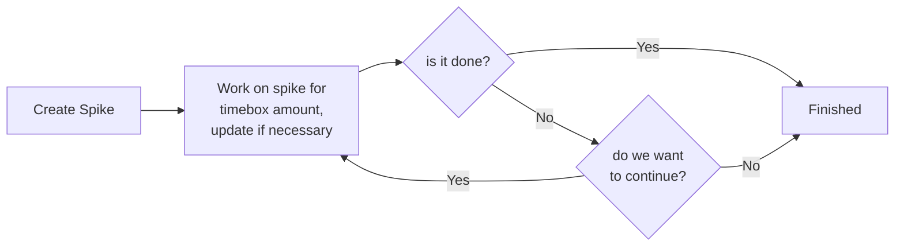

## Writing a Spike at `conda`

### Summary

In this document, we go over the procedure to follow when create spike issues. Exactly what
these types of issues are and the steps to take when creating them are all outlined
below. These guidelines apply for all projects falling underneath the
[conda](github.com/conda) organization.

### What is a Spike?

A spike is a term that is borrowed from extreme programming and agile development.
They are used when the **outcome of an issue is unknown or even optional**. For example,
when first coming across a problem that has not been solved before, a team may choose
to either research the problem or create a prototype in order to better understand it.

Additionally, spikes represent work that **may or may not actually be completed
or implemented**. An example of this are prototypes created to explore possible solutions.
Not all prototypes are implemented and the purpose of creating a prototype
is often to explore the problem space more. For research oriented tasks, the end result
of this research may be that a feature request simply is not viable at the moment and
would result in putting a stop to that work.

Finally, spikes are **time boxed**. This means that we set a definite limit on how long
we want our contributors to work on a spike issue. We do this to prevent contributors
from falling into a rabbit hole they may never return from (scary!). Instead, we set
a time limit, typically between 1 and 3 days, to perform work on the spike and then
have the assignee report back to the development team. If the deliverables defined in
the spike have not yet been completed, a decision is made on whether it makes sense
to perform further work on the spike.

Below is what that workflow looks like:

### When do I create a spike?

A spike should be created when we do not have enough information to move forward with solving
a problem. That simply means whenever we are dealing with unknowns or processes which our
development team has never encountered before, it may be useful for us to create a spike issue.

In our day-to-day work, this may appear when new bug reports or feature requests
come in which deal with problems or technologies that our development team is unfamiliar with.
For all issues which our development team has sufficient knowledge of, these issues should
instead be created as regular issues.

### How do I create a spike?

#### All spikes need to following information

- The "spike" label
- A timebox between 0 and 3 days (e.g. 4 hours; 2 days)
- Background information for a would-be assignee
- Clear deliverables. These should state exactly what needs to be done.
  For example, if we expect to create another issue as result of this spike, that should be stated.

#### Additional guidelines to be aware of

- Spikes can be created from existing issues. Bug reports are a good example of this. When converting
  existing issues, make sure the issues have all of the requirements from above.
- If a spike only has a single deliverable and a low timebox, consider adding it as a task to another
  related issue

### How do I complete a spike?

Determining whether a spike is complete should be an easy task provided
that the deliverables have been clearly defined. When this is not the case, you should
not work on the issue and instead attempt to clarify the deliverables with those also
working on the project.
