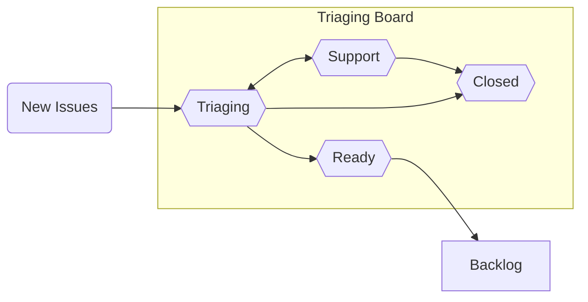

## The Triaging Process at `conda`

"Triaging" refers to the process of assessing the priority of incoming issues. Below is a high-level diagram of the flow of tickets:

In order to explain how various `conda` issues are evaluated, the following document will provide information about our triaging process in the form of an FAQ.

### Why triage?

At the most basic "bird's eye view" level, triaged issues will fall into the category of four main priority levels:

- Do now
- Do sometime
- Provide user support
- Never do (_i.e._, close)

At its core, triaging enables new issues to be sorted into these four categories, which helps to ensure that they will be processed at a velocity similar to or exceeding the rate at which new issues are coming in. One of the benefits of actively triaging issues is to avoid engineer burnout and make necessary work sustainable; this is done by eliminating a never-ending backlog that has not been reviewed by any maintainers.

There will always be broad-scope design and architecture implementations that the `conda` maintainers will be interested in pursuing; by actively triaging issues, the triaging engineers will be able to more easily track and tackle both specific and big-picture goals.

### Who triages?

<!-- This section is still a WIP, there is no official triaging engineer team yet to link to -->

Triaging engineers are a `conda` governance [sub-team](https://github.com/conda-incubator/governance#sub-teams); they are a group of Anaconda and community members who are responsible for making decisions regarding closing issues and setting feature work priorities, amongst other triage-related tasks. The list of current members is listed [here](future link)

### How do items show up in triaging?

New issues that are opened in any of the repositories in the [`conda` GitHub project](https://github.com/conda) will show up in the `New` column of the [Triaging board](https://github.com/orgs/conda/projects/4). This process is executed via [GitHub Actions](https://docs.github.com/en/actions). The two main GitHub Actions workflows utilized for this purpose are [Issues](https://github.com/conda/infra/blob/main/.github/workflows/issues.yml) and [Boards](https://github.com/conda/infra/blob/main/.github/workflows/boards.yml).

The GitHub Actions in the `conda/infra` repository are viewed as canonical; the [Sync workflow](https://github.com/conda/infra/blob/main/.github/workflows/sync.yml) sends out any modifications to [other `conda` repositories](https://github.com/conda/infra/blob/main/.github/sync.yml#L3-L17) from there.

### What is done about the issues in "triaging" mode?

Issues in the "Triaging" column of the board have been reviewed by a triaging engineer and are considered ready for the following procedures:

- Mitigation via short-term workarounds and fixes
- Redirection to the correct project
- Determining if support can be provided for errors and questions
- Closing out of any duplicate/off-topic issues

The triaging engineers on rotation are not seeking to _resolve_ issues that arise. Instead, the goal is to understand the ticket and to understand whether it is an issue in the first place and to then collect as much relevant information as possible so that the maintainers of `conda` can make an informed decision on the appropriate resolution schedule necessary.

Issues will remain in the "Triaging" column as long as the issue is in an investigatory phase (_e.g._, querying the user for more details, asking the user to attempt other workarounds, other debugging efforts, etc.) and are likely to remain in this state the longest but should still be progressing over the course of 1-2 weeks.

### When do items move out of the "Triaging" column?

The additional columns in the triaging board that the issues can be moved to include the following:

- **"Support"** - Any issue moved into this column is a request for support and is not a feature request or a bug report. All issues in this column should include the https://github.com/conda/infra/labels/type%3A%3Asupport label.
- **"Ready"** - The issue has revealed a bug or feature request. We have collected enough details to understand the problem/request and to reproduce it on our own. These issues are ready to be moved into the Backlog at the end of the triage rotation during Refinement.
- **"Closed"** - The issue was closed due to being a duplicate, being redirected to a different project, was a user error, a question that has been resolved, etc.

### Where do items go after being triaged?

All triaged issues will be reviewed by triaging engineers during a weekly Refinement meeting in order to understand how the triaged issues fit into the short- and long-term roadmap of `conda`. These meetings enable the triaging engineers to get together to collectively prioritize issues, earmark feature requests for specific future releases (versus a more open-ended backlog), tag issues as ideal for first-time contributors, as well as whether or not to close/reject specific feature requests.

Once issues are deemed ready to be worked on, they will be moved to the [`conda` Backlog project board](https://github.com/orgs/conda/projects/5) on GitHub. Once actively in progress, the issues will be moved to the [Sprint project board](https://github.com/orgs/conda/projects/8) and then closed out once the work is complete.

### What is the purpose of having a "backlog"?

Issues are "backlogged" when they have been triaged but not yet earmarked for an upcoming release. Weekly Refinement meetings are a time when the `conda` engineers will transition issues from "[Triage](https://github.com/orgs/conda/projects/4)" to "[Backlog](https://github.com/orgs/conda/projects/5)". Additionally, this time of handoff will include discussions around the kind of issues that were raised, which provides an opportunity to identify any patterns that may point to a larger problem.

### What is the purpose of a "development sprint"?

After issues have been triaged and backlogged, they will eventually be moved into the "To Do" or "In Progress" columns on the [sprint board](https://github.com/orgs/conda/projects/8) and get one or more sprint cycles dedicated to them.

The purpose of a development sprint is to enable a steady delivery of enhancements, features, and bug fixes by setting aside pre-determined portions of time that are meant for focusing on specifically-assigned items.

Sprints also serve to focus the engineering team's attention on more accurate planning for what is to come during the entire release cycle, as well as keep the scope of development work concise. They enable the setting aside of dedicated time for the engineers to resolve any problems with the work involved, instead of pushing these problems to the end of the release cycle when there may not be any time remaining to fix issues.

### How does labeling work?

Labeling is a very important means for triaging engineers to keep track of the current state of an issue with regards to the asynchronous nature of communicating with users. Utilizing the proper labels helps to identify the severity of the issue as well as to quickly understand the current state of a discussion.

Generally speaking, labels with the same category are considered mutually exclusive but in some cases labels sharing the same category can occur concurrently as they indicate qualifiers as opposed to types. For example, we may have the following types, https://github.com/conda/infra/labels/type%3A%3Abug, https://github.com/conda/infra/labels/type%3A%3Afeature, and https://github.com/conda/infra/labels/type%3A%3Adocumentation, where for any one issue there would be _at most_ **one** of these to be defined (_i.e._ an issue shouldn’t be a bug _and_ a feature request at the same time). Alternatively, with issues involving specific operating systems (_i.e._, https://github.com/conda/infra/labels/os%3A%3Alinux, https://github.com/conda/infra/labels/os%3A%3Amacos, and https://github.com/conda/infra/labels/os%3A%3Awindows), an issue could be labeled with one or more depending on the system(s) the issue is occurring on.

Please note that there are also automation policies in place. For example, if an issue is labeled as https://github.com/conda/infra/labels/pending%3A%3Afeedback and https://github.com/conda/infra/labels/unreproducible, that issue will be auto-closed after a month of inactivity.

### How are new labels defined?

Labels are defined using a scoped syntax with an optional high-level category (_e.g._, source, tag, type, etc.) and a specific topic, much like the following:

- `[topic]`
- `[category::topic]`
- `[category::topic-phrase]`

This syntax helps with triage enforcement; at minimum, both `type` and `source` labels should be specified on each issue before moving it from "`Triaging`" to "`Ready`".

There are a number of labels that have been defined for the different `conda` projects. In order to create a streamlined triaging process, label terminologies are standardized using similar (if not the same) labels.

### Are there any templates to use as responses for commonly-seen issues?

Some of the same types of issues appear regularly (_e.g._, issues that are duplicates of others, tickets that should be filed in the Anaconda issue tracker, errors that are due to a user's specific setup/environment, etc.).

Below are some boilerplate responses for the most commonly-seen triaging issues:

##### Duplicate Issue

"Closing this issue since this is a duplicate of **[link to primary issue]**; please feel free to add any additional discussion items to that issue directly."

> **Note:** In addition to posting the above comment, make sure to apply the `duplicate` label on the issue being closed and `duplicate::primary` to the issue which was filed originally.

##### Ticket Should be in the Anaconda Issue Tracker

"Thank you for filing this issue! Due to the contents of this ticket being off-topic for this repo, we ask that you please file a new one in the [Anaconda issue tracker](https://github.com/ContinuumIO/anaconda-issues/issues) (it is the place for `conda` installer/package manager issues) if you are still encountering this problem."

> **Note:** Be sure to apply the `off-topic` label for these tickets before closing them out.

##### Requesting an Uninstall/Reinstall of `conda`

"Please uninstall your current version of `conda` and reinstall the latest version. Feel free to use either the [miniconda](https://docs.conda.io/en/latest/miniconda.html) or [anaconda](https://www.anaconda.com/products/individual#windows) installer, whichever is more appropriate for your needs."

##### "Out of Scope" Issue

"Unfortunately, this issue is outside of the scope of support via GitHub; if you continue to experience the problems described here, please post details to the [Nucleus forums](https://community.anaconda.cloud/)."

In order to not have to manually type or copy/paste the above repeatedly, please note that it's possible to add text for the most commonly-used responses via [GitHub's "Add Saved Reply" option](https://docs.github.com/en/get-started/writing-on-github/working-with-saved-replies/creating-a-saved-reply).
