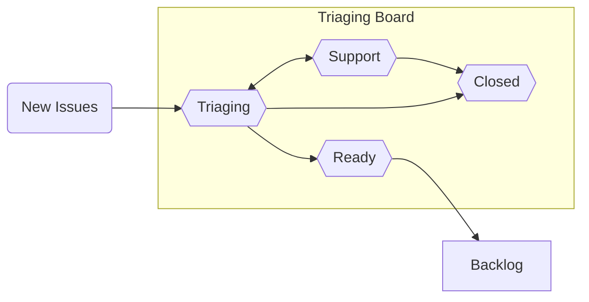

## The Triaging Process at `conda`

"Triaging" refers to the process of assessing the priority of incoming issues. Below is a high-level diagram of the flow of tickets:

In order to explain how various `conda` issues are evaluated, the following document will provide information about our triaging process in the form of an FAQ.

### Why triage?

At the most basic "bird's eye view" level, triaged issues will fall into the category of four main priority levels:

- Do now
- Do sometime
- Provide user support
- Never do (_i.e._, close)

At its core, triaging enables new issues to be sorted into these four categories, which helps to ensure that they will be processed at a velocity similar to or exceeding the rate at which new issues are coming in. One of the benefits of actively triaging issues is to avoid engineer burnout and make necessary work sustainable; this is done by eliminating a never-ending backlog that has not been reviewed by any maintainers.

There will always be broad-scope design and architecture implementations that the `conda` team will be interested in pursuing; by actively triaging issues, the triaging engineers will be able to more easily track and tackle both specific and big-picture goals.

### Who triages?

<!-- NOTE FOR WHILE THIS PR IS IN DRAFT MODE: This section is totally a WIP, there is no official triaging engineer team yet to link to -->

Triaging engineers are a `conda` governance [sub-team](https://github.com/conda-incubator/governance#sub-teams); they are a group of Anaconda and community members who are responsible for making decisions regarding closing issues and setting feature work priorities, amongst other triage-related tasks. The list of current members is listed [here](future link)

### How do items show up in triaging?

New issues that are opened in any of the repositories in the [`conda` GitHub project](https://github.com/conda) will show up in the `New` column of the [Triaging board](https://github.com/orgs/conda/projects/4). This process is executed via [GitHub Actions](https://docs.github.com/en/actions). The two main GitHub Actions workflows utilized for this purpose are [Issues](https://github.com/conda/infra/blob/main/.github/workflows/issues.yml) and [Boards](https://github.com/conda/infra/blob/main/.github/workflows/boards.yml).

The GitHub Actions in the `conda/infra` repository are viewed as canonical; the [Sync workflow](https://github.com/conda/infra/blob/main/.github/workflows/sync.yml) sends out any modifications to [other `conda` repositories](https://github.com/conda/infra/blob/main/.github/sync.yml#L3-L17) from there.

### What is done about the issues in "triaging" mode?

Issues in the "Triaging" column of the board have been reviewed by a triaging engineer and are considered ready for the following procedures:

- Mitigation via short-term workarounds and fixes
- Redirection to the correct project
- Determining if support can be provided for errors and questions
- Closing out of any duplicate/off-topic issues

The triaging engineer on rotation is not seeking to _resolve_ issues that arise. Instead, the goal is to understand the issue and to understand whether it is an issue in the first place and to then collect as much relevant information as possible so that the maintainers of `conda` can make an informed decision on the appropriate resolution schedule necessary.

Issues will remain in the "Triaging" column as long as the issue is in an investigatory phase (_e.g._, querying the user for more details, asking the user to attempt other workarounds, other debugging efforts, etc.) and are likely to remain in this state the longest but should still be progressing over the course of 1-2 weeks.

### When do items move out of "Triaging"?

The additional columns in the triaging board that the issues can be moved to include the following:

- **"Support"** - Any issue moved into this column is a request for support and is not a feature request or a bug report.
- **"Ready"** - The issue has revealed a bug or feature request. We have collected enough details to understand the problem/request and to reproduce it on our own. These issues are ready to be moved into the Backlog at the end of the triage rotation during Refinement.
- **"Closed"** - The issue was closed due to being a duplicate, being redirected to a different project, was a user error, a question that has been resolved, etc.

### Where do items go after being triaged?

All triaged issues will be reviewed by triaging engineers during a weekly Refinement meeting in order to understand how the triaged issues fit into the short- and long-term roadmap of `conda`. These meetings enable the triaging engineers to get together to decide the prioritization of issues; the outcome of these discussions are made publicly available via [GitHub Milestones](https://github.com/conda/conda/milestones). It will also be during Refinement where decisions are made to earmark feature requests for specific future releases (versus a more open-ended backlog), tag issues as ideal for first-time contributors, as well as whether or not to close/reject specific feature requests.

Once issues are deemed ready to be worked on, they will be moved to the [`conda` Backlog project board](https://github.com/orgs/conda/projects/5) on GitHub. Once there, the timeline of when/how to work on each issue is decided by members of the `conda` team. When actively in-progress, the issues will be moved to the [Sprint project board](https://github.com/orgs/conda/projects/8) and then closed out once the work is complete.

### What is the purpose of having a "backlog"?

Issues are "backlogged" when they have been triaged but not yet earmarked for an upcoming release. Weekly Refinement meetings are a time when the `conda` engineers will transition issues from "[Triage](https://github.com/orgs/conda/projects/4)" to "[Backlog](https://github.com/orgs/conda/projects/5)". Additionally, this time of handoff will include discussions around the kind of issues that were raised, which provides an opportunity to identify any patterns that may point to a larger problem.

### What is the purpose of a "development sprint"?

[TODO]

### How does labeling work?

[TODO]

### How are new labels defined?

[TODO]
